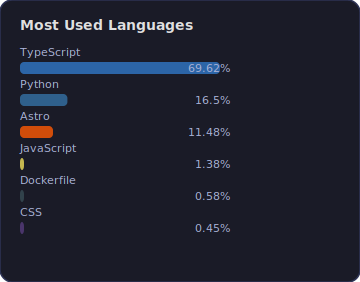

<div align="center">
  
</div>

<h1 align="center">
  
</h1>

```yaml
---

name: Luis Eduardo Albor Vega
alias: LEAV
location: Colombia
role: Full-Stack Developer

stack:
  frontend: [React, Angular, TypeScript, JavaScript, TailwindCSS]
  backend:  [Python, Django, FastAPI, Java, C#]
  cloud:    [AWS (S3, Lambda, ECS, EC2, ECR, RDS, CloudFront, Route53, WAF), Docker, K8s]
  database: [PostgreSQL, SQLite]
  tools:    [GitHub Actions, CI/CD, Web Scraping, OpenCV]

experience: 28+ months
focus: Clean Architecture, Scalable Systems, Team Leadership

---
```

<div align="center">
  <h2>Proyectos Destacados</h2>
</div>

<table align="center">
  <tr>
    <td align="center" width="50%">
      <a href="https://github.com/leav-dev/shaun">
        <h3>shaun</h3>
      </a>
      <sub>Kanban board</sub>
      <br /><br />
      
    </td>
    <td align="center" width="50%">
      <a href="https://github.com/leav-dev/utilspress">
        <h3>utilspress</h3>
      </a>
      <sub>Procesamiento de imágenes y PDF</sub>
      <br /><br />
      
    </td>
  </tr>
  <tr>
    <td align="center" width="50%">
      <a href="https://github.com/leav-dev/api-clima">
        <h3>api-clima</h3>
      </a>
      <sub>API meteorológica</sub>
      <br /><br />
      
    </td>
    <td align="center" width="50%">
      <a href="https://github.com/leav-dev/bot-detector">
        <h3>bot-detector</h3>
      </a>
      <sub>GUI automation bot</sub>
      <br /><br />
      
    </td>
  </tr>
</table>

<div align="center">
  <h2>Stack Tecnológico</h2>
</div>

<div align="center">
  <h3>Frontend</h3>
  
  
  
  
  
  

  <h3>Backend</h3>
  
  
  
  
  

  <h3>Cloud & DevOps</h3>
  
  
  
  

  <h3>Base de Datos</h3>
  
  
</div>

<div align="center">
  <h2>Estadísticas</h2>
</div>

<div align="center">
  
</div>

<div align="center">
  <h2>Conecta conmigo</h2>
  <a href="mailto:luise.albor@gmail.com">
    
  </a>
  <a href="https://www.linkedin.com/in/luis-albor/">
    
  </a>
  <a href="https://github.com/leav-dev">
    
  </a>
</div>

<div align="center">
  
</div>
